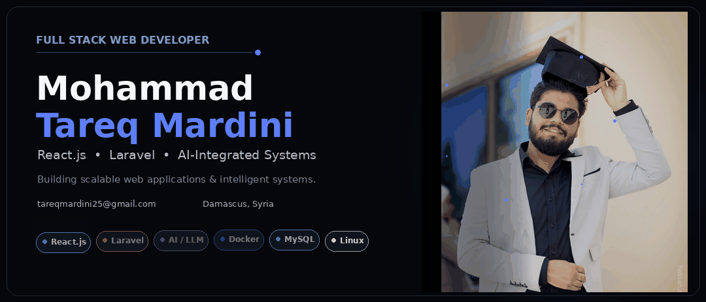

  

 

## About

Full Stack Web Developer focused on building **scalable web applications, intelligent systems, and production-ready software**.

I enjoy working across the full development lifecycle — from architecture and API design to frontend development, AI integration, and deployment.

---

## What I Build

* Full-stack web applications
* RESTful APIs & backend systems
* AI / LLM & RAG applications
* E-commerce and business platforms
* React-based desktop applications
* Dockerized applications & production deployments

---

## Selected Work

**AI Document Intelligence · RAG**
Document-based AI platform using semantic search, embeddings, Qdrant, and LLMs.

**E-Commerce Platform**
Multilingual React e-commerce application with product management, checkout, coupons, orders, and administration.

**Real Estate Visualization**
Interactive Canvas-based platform for exploring buildings and apartments through dynamic layouts.

**Freelancer Marketplace**
Full-stack Laravel marketplace with projects, bidding, messaging, payments, and secure file uploads.

---

## Engineering

`REST APIs` · `MVC` · `Database Design` · `Query Optimization` · `Secure Coding` · `Docker` · `CI/CD` · `Linux VPS` · `Nginx`

---

## Beyond Development

**400+** algorithmic problems solved
**B.Eng.** Software Engineering · Syrian Private University

---

## Connect

  
  

  Building software that turns complex ideas into practical systems.

